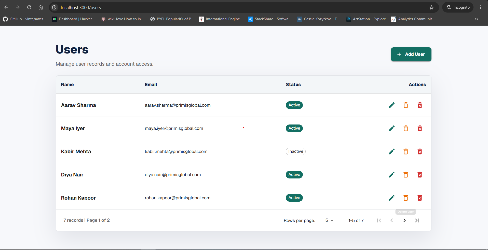

# Primis Global Assement FE

Frontend application for Primis-Global-Assement built with Next.js App Router, React, TypeScript, and Material UI.



## Tech Stack

- Next.js `16.2.9`
- React `19.2.4`
- TypeScript
- Material UI `9.1.1`
- Emotion for MUI styling
- Tailwind CSS v4 global setup
- Docker production image with Next standalone output

## Requirements

- Node.js `20.9.0` or newer
- npm
- Docker, optional for containerized production runs

## Installation

```bash
npm install
```

## Local Development

```bash
npm run dev
```

Open:

```text
http://localhost:3000
```

The root route redirects to `/login`.

## Available Scripts

| Command | Description |
| --- | --- |
| `npm run dev` | Starts the local Next.js dev server. |
| `npm run build` | Creates a production build. |
| `npm run start` | Starts the production server after `npm run build`. |
| `npm run lint` | Runs ESLint. |

## Pages

| Route | File | Description |
| --- | --- | --- |
| `/` | `app/page.tsx` | Redirects to `/login`. |
| `/login` | `app/login/page.tsx` | Split-screen login page with username, password, and submit button. |
| `/users` | `app/users/page.tsx` | Users management page with table, add/edit dialog, delete actions, and pagination. |

## Users Page Features

- Renders a Material UI table of users.
- Each row has Edit, Delete, and Permanent Delete actions.
- Delete marks a user as inactive.
- Permanent Delete removes the row from the table.
- Add User opens a dialog with:
  - `first_name`
  - `last_name`
  - `email`
  - `password`
- Edit User opens the dialog without the password field.
- Dialog has Submit and Cancel buttons.
- Pagination below the table shows total records and current page count.
- Rows-per-page options are `5`, `10`, and `25`.

Current user data is in client state only, so changes reset on page refresh.

## Component Structure

```text
app/
  components/
    UserFormDialog.tsx      Add/edit user dialog
    UsersPageContent.tsx    Users page state and actions
    UsersPagination.tsx     Table pagination footer
    UsersTable.tsx          Users table and row action buttons
    types.ts                Shared users types
  login/
    page.tsx                Login route
  users/
    page.tsx                Users route
  layout.tsx                Root layout
  page.tsx                  Root redirect
  providers.tsx             MUI theme and Next App Router cache provider
```

## Material UI Setup

MUI is configured in `app/providers.tsx` using:

- `AppRouterCacheProvider` from `@mui/material-nextjs/v16-appRouter`
- `ThemeProvider`
- `CssBaseline`

The app uses `output: "standalone"` in `next.config.ts` so Docker can run a smaller production image.

## Docker

Build the production image:

```bash
docker build -t primis-global-assement-fe .
```

Run the container in the foreground:

```bash
docker run --rm -p 3000:3000 primis-global-assement-fe
```

Run the container in the background:

```bash
docker run -d --name primis-global-assement-fe -p 3000:3000 primis-global-assement-fe
```

View container logs:

```bash
docker logs -f primis-global-assement-fe
```

Stop the background container:

```bash
docker stop primis-global-assement-fe
```

Remove the stopped container if needed:

```bash
docker rm primis-global-assement-fe
```

Open the app:

```text
http://localhost:3000
```

## Docker Notes

- The Dockerfile uses a multi-stage build.
- Dependencies are installed with `npm ci`.
- The production runtime uses `node:22-alpine`.
- The final container starts with `node server.js`.
- Port `3000` is exposed.
- `.dockerignore` excludes local build output, dependencies, git files, and local environment files.

## Production Without Docker

```bash
npm run build
npm run start
```

Open:

```text
http://localhost:3000
```

## Quality Checks

Run lint:

```bash
npm run lint
```

Run production build:

```bash
npm run build
```
